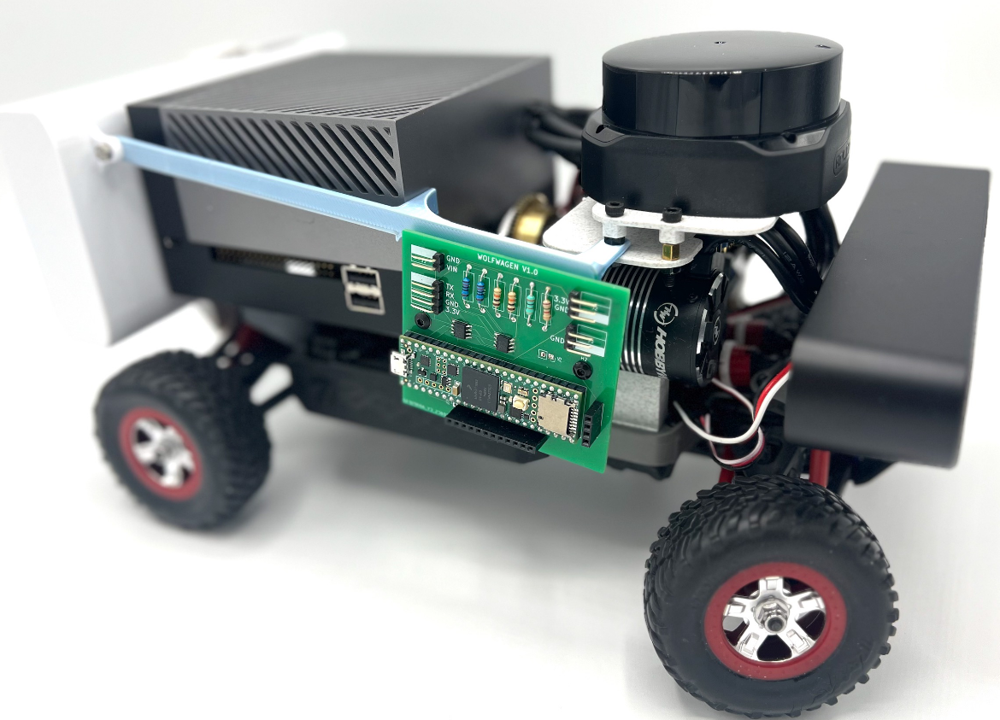
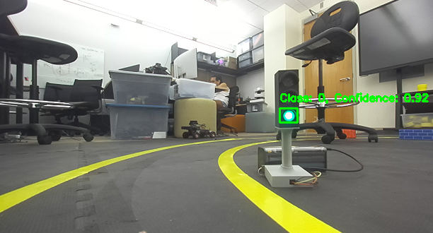
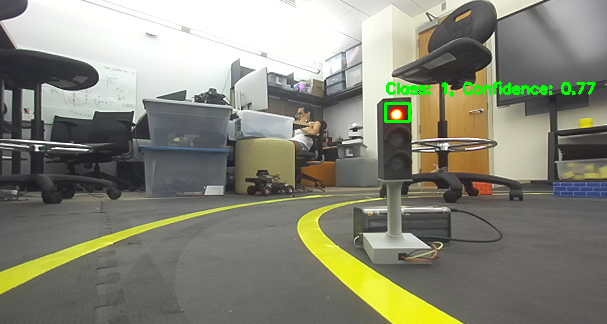

[](https://classroom.github.com/a/Qh7sF4GO)

# Computer Vision Based Self Driving Car with Traffic Light Color and Lane Obstacle Detection



The RC car utilizes NVIDIA orin, ZED camera, LiDAR sensor, EZRUN motor, Arduino, and Teensy. 

### Team Members
- Sean Yi 
- Jaejin Bae 
- Annie Lowman

## Project Description
The main project objective is to detect traffic stop light colors and obstacles that appear in the lane. To achieve traffic stop light detection, the YOLOv8 nano size model was implemented. It was then trained on Roboflow's [Traffic Light Detection Dataset](https://universe.roboflow.com/sreya-3iisz/traffic-light-detection-ozcos), in which pictures of the traffic light model was added. The model was then trained with an epoch of 50 and a batch size of 10.

Depth detection used LiDAR to detect if there was anything in front of the car. While we originally tried to use the same ZED camera that was used for traffic stop light detection for depth detection, calculating the depth and implementing the code proved to be quite finicky. Thus, the approach was switched to check an area of ~54 degrees in front of the car with LiDAR. If the range fell below the distance threshold, the car will stop.

Finally, we realized the main project objective only controls the throttle of the car. For a sub project objective of being self driving, we added our `lane_follower.py` from project 4.  

## System
In order to run this project ros2 packages must be installed to gather data from sensors. 
### Environment
Hardware Components
- ZED 2i
- ESC
- Servo Motors
- RPLiDAR S2
- NVIDIA Jetson AGX Orin
- Arduino 
- Teensy

Software Components
- Python 3.8+
- [ultralytics Python library](https://pypi.org/project/ultralytics/)  
- [Xbox controller (Joy node)](https://index.ros.org/p/joy/)
- [Zed 2i wrapper](https://github.com/stereolabs/zed-ros2-wrapper)
- [LiDAR Sensor](https://github.com/Slamtec/sllidar_ros2)

### Setup  
1. Run all of ros2 nodes in different terminals:  
```
ros2 run joy joy_node --ros-args -p autorepeat_rate:=0.0  (Xbox controller)
```
```
ros2 launch zed_wrapper zed2i.launch.py (ZED camera)
```  
```
ros2 launch sllidar_ros2 sllidar_s2_launch.py (LiDAR)
```
2. Run `driver.py` and `xbox_controller.py` in different terminals to connect the xbox controller to the car:
```
python3 driver.py
```
```
python3 xbox_controller.py
```
3. Connect the battery to the ESC motor and turn it on 
4. Run `lane_follower.py` and `yolo_and_depth.py` in different terminals to enable CV based lane following, traffic light detection, and depth detection:
```
python3 lane_follower.py
```
```
python3 yolo_and_depth.py
```
5. Press "A" button of the xbox controller to enable auto driving mode

## Expected results

The RC car should...
- Follow the yellow taped lanes by itself. We implemented PID to ensure that the car will follow the center of the lane.
- Recognize the traffic light colors by our custom trained YOLOv8 model.
    - Our custom trained YOLO model has about an 85% accuracy and an 82% average confidence score in our test cases.
    - The car should continue to move forward if it detects a green light
      
        

    - If the car detects a red light, as shown bellow, it will stop immedietly and wait until the traffic lights change.
      
        

- Detect any obstacle on the track in front of the car and stop until object is removed
    - Will detect any object in front of the car, from a range of ±45 degrees of the yaw axis while it is less than the distance threshold of 70 cm

## Demo video
View point of the custom YOLOv8 model, top: `lane_follower.py`, bottom: `yolo_and_depth.py`


View point of the car from third party:

